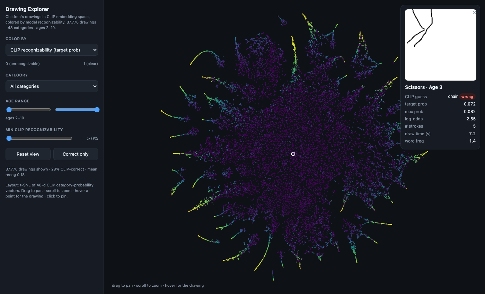

# Children's Drawing Explorers

Interactive web pages for exploring a large dataset of **children's drawings**
(48 categories, ages 2–10).

🔗 **Landing page:** https://vislearnlab.github.io/drawing-explorer/

The site root (`index.html`) is a landing page linking the explorers below;
it's the single URL to cite. The two in-repo explorers are:

- **`explorer.html`** — the CLIP-embedding map of all ~37,770 drawings, colored
  by model recognizability (described in *What it shows*, below).
- **`strokes.html`** — a **stroke-by-stroke** player: drawings render from their
  per-stroke SVG paths, colored by agreed semantic part, with autoplay and a
  side-by-side compare mode. Data is built by `build_strokes.py` into
  `strokes_data/`. See `build_strokes.py`'s docstring for the source inputs.



## What the CLIP map (`explorer.html`) shows

- Drawings laid out by a 2-D **t-SNE** of the 48-d CLIP per-category probability
  vectors. Each point is one drawing.
- **Color by:** CLIP recognizability (probability of the intended category,
  default), correct/incorrect, log-odds, age, or category.
- **Filters:** category, age range, minimum recognizability, correct-only.
- **Hover** a point to see the drawing + its scores; **click** to pin it.
- The footer stat bar updates with the count / % CLIP-correct / mean
  recognizability of the currently visible subset.

## Run locally

```bash
python3 -m http.server 8000
# open http://127.0.0.1:8000/
```

(open `http://127.0.0.1:8000/` for the landing page; drawing PNGs live in
`drawings/`.)

## Files

- `index.html` — landing page linking the explorers (cite this URL).
- `explorer.html` — the self-contained CLIP-map explorer (no build step).
- `strokes.html` — the self-contained stroke-by-stroke player (no build step).
- `points.json` — t-SNE layout + per-drawing CLIP scores consumed by `explorer.html`.
- `strokes_data/` — per-category stroke JSON consumed by `strokes.html`.
- `drawings/` — the 37,770 drawing PNGs (150×150).
- `build_data.py` — regenerates `points.json` from the source CLIP embeddings
  and recognizability tables (see below).
- `build_strokes.py` — regenerates `strokes_data/` from the agreed part labels
  and raw per-stroke SVGs.

## License

Licensed under **CC BY-NC 4.0** (free to use with attribution, non-commercial).
See [`LICENSE`](LICENSE). Please credit the Visual Learning Lab (UC San Diego)
and cite the dataset paper (above).

## Rebuilding `points.json`

`build_data.py` expects the source data from the
[`drawing_production_and_recognition`](https://github.com/cogtoolslab/drawing_production_and_recognition)
repository (CLIP feature `.npy`, metadata, and `merged_clip_class_and_meta.csv`).
Point the paths at that checkout and run:

```bash
python3 build_data.py
```

## Data & paper

Drawings and recognizability scores come from:

> Long, B. et al. *Parallel developmental changes in children's production and
> recognition of line drawings of visual concepts.*
> [PsyArXiv](https://psyarxiv.com/5yv7x/) · [OSF](https://osf.io/qymjr/)

## License

Drawings and data: CC BY-NC-SA 4.0 (per the source dataset).
